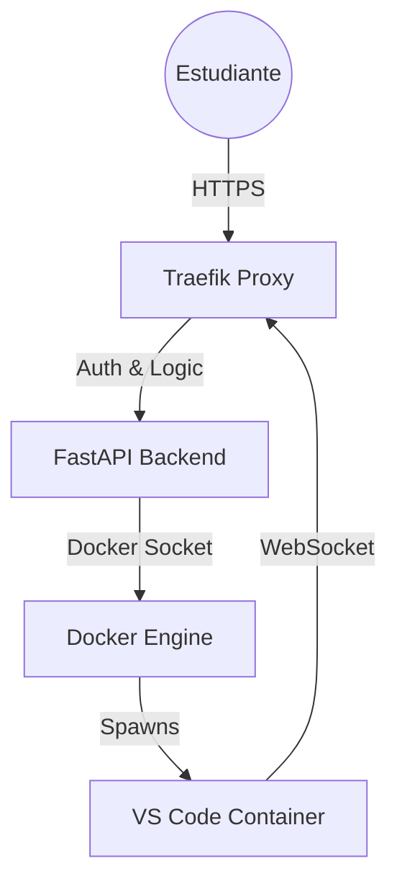

# 🚀 Sistema de Orquestación de Laboratorios Virtuales (SOLV)

> "Adiós al 'En mi máquina funciona'. Hola a entornos de desarrollo estandarizados, efímeros y accesibles desde el navegador."

---

## 📖 Descripción del Proyecto

Este proyecto es una plataforma de **Orquestación de Contenedores** diseñada para instituciones educativas. Su objetivo es democratizar el acceso a herramientas de desarrollo avanzadas, permitiendo a los estudiantes acceder a un IDE completo (VS Code Server) directamente desde su navegador, sin necesidad de instalaciones locales ni hardware potente.

El sistema gestiona automáticamente el ciclo de vida de los contenedores (creación, inicio, detención y eliminación), garantizando la persistencia de los datos del estudiante sesión tras sesión.

---

## 🛑 El Problema que resolvemos

- ⏳ **Tiempos muertos:** Clases perdidas configurando entornos y librerías.
- 💻 **Incompatibilidad:** El clásico error *"Funciona en Windows pero no en Mac"*.
- 🚧 **Barrera de entrada:** Estudiantes con equipos limitados no pueden correr software pesado.

---

## 🛠️ Arquitectura Técnica

El sistema utiliza una arquitectura modular basada en contenedores, desplegada 100% **On-Premise**.



### 🔧 Tecnologías Clave

- **Backend:** Python 3.11 + FastAPI (manejo de concurrencia y WebSockets).
- **Orquestación:** Docker SDK for Python (gestión de bajo nivel de contenedores).
- **Networking:** Traefik (reverse proxy dinámico para subdominios y certificados SSL).
- **Seguridad:** Google OAuth2 (validación estricta de dominio institucional @uab.edu.bo).
- **Frontend:** HTML5/JS (Dashboard) + Code-Server (entorno de desarrollo).

---

## ✨ Características Principales

- ✅ **Zero-Setup:** El estudiante inicia sesión y programa en menos de 5 segundos.
- ✅ **Persistencia Inteligente:** Uso de Docker Volumes (bind mounts) para que los archivos sobrevivan a la destrucción del contenedor.
- ✅ **Aislamiento Total:** Cada estudiante tiene su propio Kernel Linux y recursos asignados (CPU/RAM).
- ✅ **Seguridad RBAC:**
  - Integración con Google Login.
  - Whitelist: Solo estudiantes matriculados pueden instanciar laboratorios.
- ✅ **Auto-Limpieza:** Garbage Collector automatizado que detiene contenedores inactivos y libera RAM.

---

## 🚀 Instalación y Despliegue (Local)

Sigue estos pasos para levantar el orquestador en tu máquina local.

### 📋 Prerrequisitos

- Docker & Docker Compose v2.0+
- Python 3.9+
- Credenciales de Google Cloud Console (Client ID & Secret)

---

### 1️⃣ Clonar el repositorio

```bash
git clone https://github.com/tu-usuario/orquestador-labs.git
cd orquestador-labs
```

---

### 2️⃣ Configurar Variables de Entorno

Crea un archivo `.env` en la raíz:

```env
GOOGLE_CLIENT_ID=tu_client_id
GOOGLE_CLIENT_SECRET=tu_client_secret
SECRET_KEY=una_clave_segura_random
DOMAIN=localhost
ADMIN_EMAILS=tu_correo@uab.edu.bo
```

---

### 3️⃣ Levantar la Infraestructura

```bash
docker-compose up -d --build
```

Visita:

```
http://localhost
```

e inicia sesión.

---

## 📂 Estructura del futuro Proyecto

```
/
├── app/
│   ├── core/           # Configuración (Security, Database)
│   ├── routers/        # Endpoints (Auth, Labs, Admin)
│   ├── services/       # Lógica de Docker (DockerManager.py)
│   └── models/         # Modelos SQL (SQLAlchemy)
├── docker/
│   ├── python-lab/     # Dockerfile para Lab de Python
│   └── java-lab/       # Dockerfile para Lab de Java
├── templates/          # Frontend (Jinja2)
├── main.py             # Punto de entrada
└── docker-compose.yml  # Orquestación de servicios
```

---

## 🔮 Roadmap / Trabajo Futuro

- [ ] Nivel 1: Dashboard de métricas en tiempo real con Grafana (CPU/RAM por alumno).
- [ ] Nivel 2: Soporte para conexión vía Túnel SSH (para VS Code Desktop).
- [ ] Nivel 3: Implementación de Cuotas de Disco (Límite de 500MB por alumno).

---

## 👨‍💻 Autor

**Alvaro Regulo Rivera Carhuani**

- 🎓 Estudiante de Ingeniería de Sistemas  
- 📍 Bolivia 
- 📧 alvaro.regulo.rivera@gmail.com 

---

> Este planea ser
 desarrollado como **Tesis de Grado** para optar al título de Ingeniero de Sistemas.
